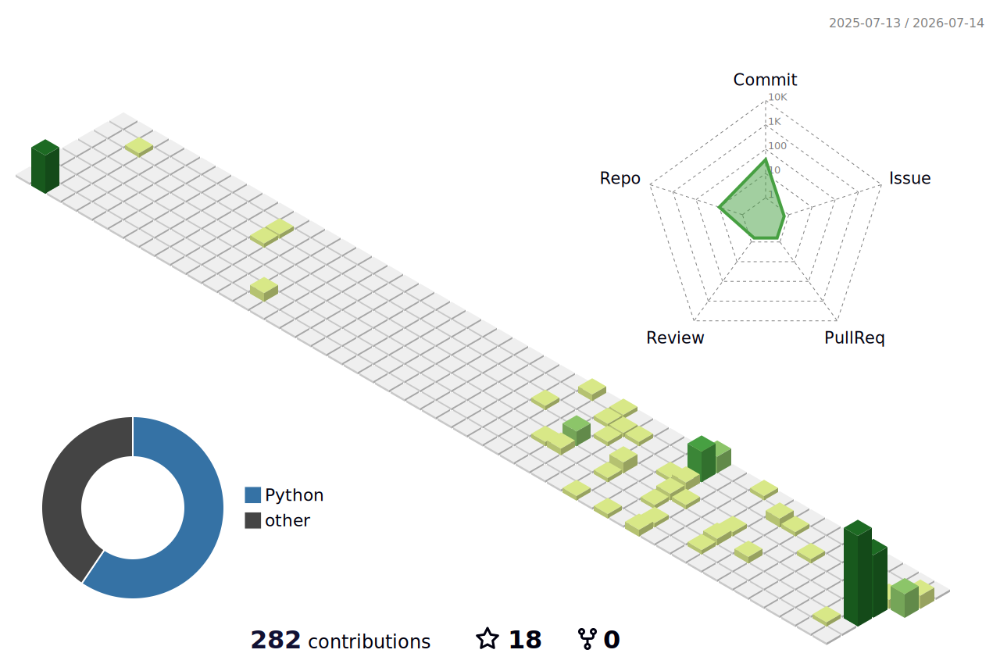

<div align="center">


`Autonomous` • `AI / ML` • `NLP` • `Agent Evals` • `Multimodal`

<br/>

[](https://linkedin.com/in/prakhar07)
[](https://twitter.com/Peterstark_01)

</div>

---

## 🧠 Agent Capabilities

<table>
<tr><td width="34%"><b>🎭 Deep Learning &amp; Vision</b><br/><sub>GANs · Swin Transformers · deepfake detection · OpenCV pipelines</sub></td>
<td align="center">
<a href="https://www.python.org"></a>
<a href="https://pytorch.org"></a>
<a href="https://www.tensorflow.org"></a>
<a href="https://opencv.org"></a>
</td></tr>
<tr><td><b>⚗️ Training &amp; Alignment</b><br/><sub>post-training &amp; preference optimization</sub></td>
<td align="center">
<a href="https://huggingface.co/blog/rlhf"></a>
<a href="https://arxiv.org/abs/2411.15124"></a>
<a href="https://huggingface.co/docs/trl/sft_trainer"></a>
<a href="https://arxiv.org/abs/2305.18290"></a>
<a href="https://huggingface.co/docs/trl/reward_trainer"></a>
<a href="https://huggingface.co/docs/peft"></a>
</td></tr>
<tr><td><b>🔁 Agentic Systems</b><br/><sub>autonomous loops · evaluation harnesses</sub></td>
<td align="center">
<a href="https://www.anthropic.com/research/building-effective-agents"></a>
<a href="https://metr.org/blog/2025-03-19-measuring-ai-ability-to-complete-long-tasks/"></a>
<a href="https://www.swebench.com"></a>
<a href="https://docs.anthropic.com/en/docs/build-with-claude/tool-use"></a>
<a href="https://modelcontextprotocol.io"></a>
<a href="https://www.anthropic.com/engineering/built-multi-agent-research-system"></a>
<a href="https://arxiv.org/abs/2303.11366"></a>
<a href="https://arxiv.org/abs/2310.08560"></a>
</td></tr>
<tr><td><b>🧠 LLM Engineering</b><br/><sub>retrieval · context · inference</sub></td>
<td align="center">
<a href="https://huggingface.co/learn/llm-course"></a>
<a href="https://arxiv.org/abs/2005.11401"></a>
<a href="https://github.com/facebookresearch/faiss"></a>
<a href="https://www.anthropic.com/engineering/effective-context-engineering-for-ai-agents"></a>
<a href="https://docs.anthropic.com/en/docs/build-with-claude/prompt-engineering/overview"></a>
<a href="https://github.com/openai/evals"></a>
<a href="https://github.com/vllm-project/vllm"></a>
</td></tr>
<tr><td><b>👁️ Multimodal</b><br/><sub>vision-language · generative media</sub></td>
<td align="center">
<a href="https://huggingface.co/blog/vlms"></a>
<a href="https://arxiv.org/abs/1406.2661"></a>
<a href="https://github.com/Sinprakhar01/Deepfake-Detection-Using-SwinGan"></a>
<a href="https://spacy.io"></a>
</td></tr>
<tr><td><b>🗣️ NLP</b><br/><sub><a href="https://spacy.io">spaCy</a> internals · industrial text pipelines · tokenization &amp; NER</sub></td>
<td align="center">
<a href="https://www.python.org"></a>
<a href="https://www.anaconda.com"></a>
<a href="https://scikit-learn.org"></a>
</td></tr>
<tr><td><b>🕵️ Agent Evaluation</b><br/><sub><a href="https://www.swebench.com">SWE-bench</a> · <a href="https://github.com/multi-swe-bench/multi-swe-bench">multi-SWE-bench</a> · <a href="https://github.com/All-Hands-AI/OpenHands">OpenHands</a> · sandboxed eval runs</sub></td>
<td align="center">
<a href="https://www.docker.com"></a>
<a href="https://github.com"></a>
<a href="https://www.gnu.org/software/bash/"></a>
</td></tr>
<tr><td><b>☁️ Cloud &amp; Infra</b><br/><sub>deployment · orchestration · containerized eval environments</sub></td>
<td align="center">
<a href="https://aws.amazon.com"></a>
<a href="https://kubernetes.io"></a>
<a href="https://vercel.com"></a>
</td></tr>
<tr><td><b>⚙️ Engineering Core</b><br/><sub>APIs · web apps · databases · systems tooling</sub></td>
<td align="center">
<a href="https://www.typescriptlang.org"></a>
<a href="https://react.dev"></a>
<a href="https://nodejs.org"></a>
<a href="https://www.java.com"></a>
<a href="https://www.rust-lang.org"></a>
<a href="https://go.dev"></a>
<a href="https://www.mysql.com"></a>
<a href="https://git-scm.com"></a>
<a href="https://www.kernel.org"></a>
</td></tr>
</table>

---

## ⚡ Agent Status

```text
prakhar@agent-console:~$ agentctl status --verbose

┌─ KAIROS · autonomous build agent ────────────────────────────────┐
│  runtime   v26.7.1 (stable)         region  Gurugram, IN         │
│  uptime    since 2023 · no crashes  tz      UTC+05:30            │
├──────────────────────────────────────────────────────────────────┤
│  MODULES                                                         │
│  ● vision       GANs · Swin-T · deepfake detection      [ACTIVE] │
│  ● agent-evals  SWE-bench · OpenHands harnesses         [ACTIVE] │
│  ● nlp          spaCy · industrial text pipelines       [ACTIVE] │
│  ● post-train   RLHF · RLVR · SFT · DPO                 [LOADED] │
│  ● infra        AWS · K8s · Docker · sandboxed evals    [LOADED] │
├──────────────────────────────────────────────────────────────────┤
│  RESOURCES                                                       │
│  curiosity    ▓▓▓▓▓▓▓▓▓▓▓▓▓▓▓▓▓▓▓▓  100%                         │
│  gpu_vram     ▓▓▓▓▓▓▓▓▓▓▓▓▓▓░░░░░░   73%  training in progress   │
│  coffee       ▓▓▓▓░░░░░░░░░░░░░░░░   21%  [REFILL REQUIRED]      │
├──────────────────────────────────────────────────────────────────┤
│  last_deploy   deepfake-detection : swingan-v2          [OK]     │
│  next_mission  exploring...                             [QUEUED] │
└──────────────────────────────────────────────────────────────────┘

prakhar@agent-console:~$ █
```

---

## 🛰️ Deployed Builds

<table>
<tr>
<td width="50%" valign="top">

### 🎭 Deepfake Detection — SwinGAN
Detecting AI-generated faces using a Swin Transformer + GAN pipeline.

`PyTorch` `Swin-T` `GANs` `Computer Vision`

[Repository →](https://github.com/Sinprakhar01/Deepfake-Detection-Using-SwinGan)

</td>
<td width="50%" valign="top">

### 🌳 Rule Engine with AST
Dynamic rule engine that parses, combines and evaluates conditional logic as abstract syntax trees.

`Python` `AST` `Flask`

[Repository →](https://github.com/Sinprakhar01/Rule-Engine-With-AST)

</td>
</tr>
<tr>
<td width="50%" valign="top">

### 🌦️ Real-Time Weather Monitor
Live weather ingestion with rollups, configurable alert thresholds and daily summaries.

`Python` `REST APIs` `SQLite`

[Repository →](https://github.com/Sinprakhar01/Real-Time-Weather-Monitoring-System)

</td>
<td width="50%" valign="top">

### 🥗 SelfSense
Food-nutrient calculator that turns everyday meals into actionable nutrition insight.

`TypeScript` `React` `Vite`

[Repository →](https://github.com/Sinprakhar01/SelfSense-food-nutrients-calculator)

</td>
</tr>
</table>

---

## 🧪 Active Research Threads

- **Coding-agent evaluation** — multi-SWE-bench and OpenHands benchmark harnesses
- **Industrial NLP** — spaCy internals and production text pipelines
- **Generative vision** — GAN architectures beyond detection
- **Network tooling** — mitmproxy-style traffic interception for debugging

---

## 📡 Telemetry

<div align="center">

<table>
<tr>
<td align="center" valign="middle" width="50%"><picture>
<source media="(prefers-color-scheme: dark)" srcset="https://github-readme-stats-prakhar2026.vercel.app/api?username=Sinprakhar01&show_icons=true&theme=tokyonight&hide_border=true&bg_color=00000000&hide_rank=true" />

</picture></td>
<td align="center" valign="middle" width="50%"><picture>
<source media="(prefers-color-scheme: dark)" srcset="https://github-readme-stats-prakhar2026.vercel.app/api/top-langs/?username=Sinprakhar01&theme=tokyonight&hide_border=true&bg_color=00000000&layout=pie&langs_count=8&card_width=420&size_weight=0.5&count_weight=0.5" />

</picture></td>
</tr>
</table>

<picture>
<source media="(prefers-color-scheme: dark)" srcset="https://streak-stats.demolab.com?user=Sinprakhar01&theme=tokyonight&hide_border=true&background=00000000" />

</picture>

<picture>
  <source media="(prefers-color-scheme: dark)" srcset="./profile-3d-contrib/profile-night-rainbow.svg" />
  
</picture>

<a href="https://github.com/Sinprakhar01?tab=overview">
<picture>
<source media="(prefers-color-scheme: dark)" srcset="https://github-readme-activity-graph.vercel.app/graph?username=Sinprakhar01&theme=tokyo-night&hide_border=true&bg_color=00000000&color=58A6FF&line=58A6FF&point=FFFFFF&area=true&hide_title=true" />

</picture>
</a>


</div>
