<div align="center">

# 🤖 Model Card: `Prakhar-1`


<br/>
<br/>

> *A large-context human model fine-tuned for building things.*
> *Trained on curiosity. Aligned with coffee. Weights not open-sourced.*

</div>

---

## 📋 Model Details

| Field | Value |
|---|---|
| **Developer** | Prakhar Singh |
| **Model type** | Human Transformer *(attention is all he needs)* |
| **Modalities** | Python · TypeScript · SQL · Hardware tinkering |
| **Languages** | English, Hindi, Regex (conversational) |
| **Base model** | `curious-human-base` |
| **Fine-tuned from** | Stack Overflow, official docs *(occasionally)*, 3 AM debugging sessions |
| **Context window** | ∞ with coffee · 4 tokens without |
| **License** | MIT — *Mostly Interested in Tech* |
| **Current run** | 🌏 `Exploring...` |

---

## 🧠 Architecture

**Core layers** *(pretrained, production-stable)*


**Attention heads** *(AI / ML focus)*


**Adapter modules** *(hot-swappable)*


---

## 🎯 Intended Use

**✅ Direct use**
- Building AI-powered systems and NLP experiments
- Benchmarking coding agents *(multi-SWE-bench, OpenHands)*
- Full-stack side projects that absolutely did not need to exist, but do

**🔧 Downstream use**
- Hackathons · open-source collabs · "wanna build something cool?"

**❌ Out-of-scope use**
- Centering a div without googling it *(again)*
- Meetings before 10 AM
- Accurate deadline estimation

---

## 📊 Evaluation Results

| Benchmark | Score | Notes |
|---|---|---|
| `repos-shipped` | **26+** | includes experimental checkpoints |
| `deepfake-detection` | SwinGAN | vision transformer fine-tuning |
| `agent-evals` | SWE-bench family | evaluation harness contributor mode |
| `coffee-to-code` | 1 : 1000 | cups per lines, approximately |

<div align="center">


</div>

---

## 📈 Training Metrics

<div align="center">



<picture>
  <source media="(prefers-color-scheme: dark)" srcset="https://raw.githubusercontent.com/Sinprakhar01/Sinprakhar01/output/github-contribution-grid-snake-dark.svg" />
  <source media="(prefers-color-scheme: light)" srcset="https://raw.githubusercontent.com/Sinprakhar01/Sinprakhar01/output/github-contribution-grid-snake.svg" />
  
</picture>

</div>

---

## ⚠️ Known Limitations & Biases

- May **hallucinate confidence** before the first coffee of the day
- **Overfits** to shiny new side projects; catastrophic forgetting of old ones
- Response latency **spikes during cricket season** 🏏
- Known **prompt injection vulnerability**: `"bro, one quick idea..."`
- Occasionally outputs `console.log("here")` in production-adjacent environments

---

## 🏆 Model Achievements

<div align="center">


</div>

---

## 🔌 Inference API

```python
from prakhar import Prakhar1

model = Prakhar1.from_pretrained("Sinprakhar01")

response = model.generate("wanna collaborate on something cool?")
# >>> "Absolutely. Ship it. 🚀"
```

**Endpoints:**

<div align="center">

[](https://linkedin.com/in/prakhar07)
[](https://twitter.com/Peterstark_01)
[](https://instagram.com/prakhar_2021)
[](https://linktr.ee/Prakhar_07)

</div>

---

## 📄 Citation

```bibtex
@misc{prakhar2026,
  author = {Singh, Prakhar},
  title  = {Prakhar-1: A Human Model Fine-Tuned for Building},
  year   = {2026},
  url    = {https://github.com/Sinprakhar01},
  note   = {Weights not open-sourced. Coffee-dependent runtime.}
}
```

<div align="center">

<sub>⚡ This model card auto-updates its metrics daily via GitHub Actions.</sub>

</div>
